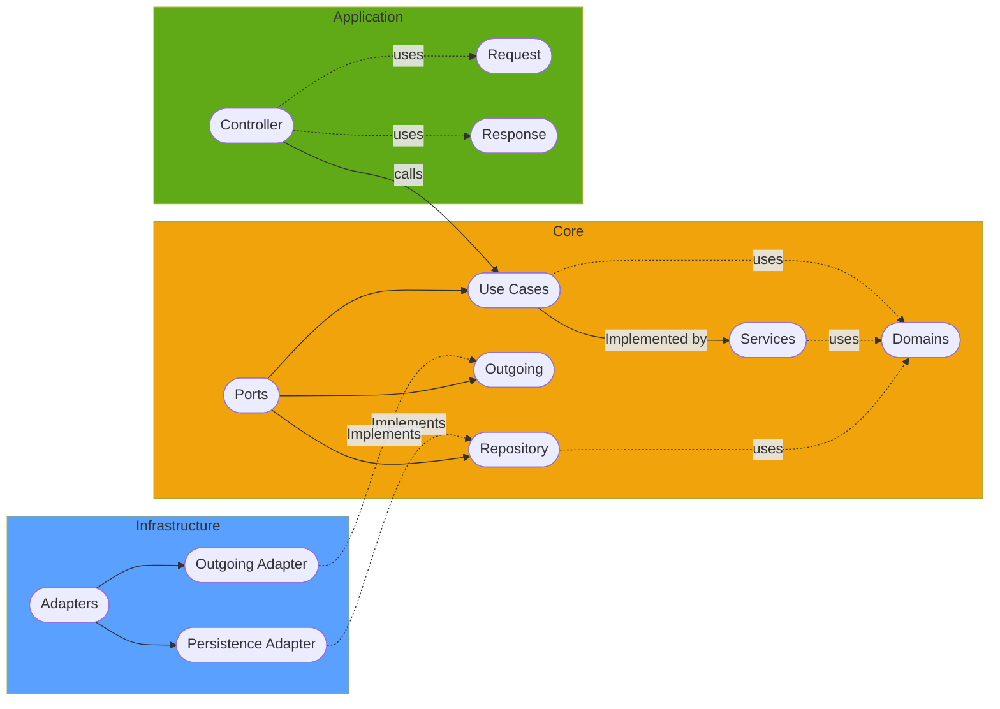

# {{ cookiecutter.project_name }}

This project was generated using the standard `java-spring-boot-service` template. Please see [this page](https://github.com/viafoura/microservices-template/blob/master/java-spring-boot-service/README.md) for more information about the build setup and rationale behind the project structure.

Owners : {{ cookiecutter.group }}

# Project structure

### Application
This layer contains all entry points to the microservice (rest endpoints, cli, etc) to be able to process
request from the external world

### Core
This layer contains all core logic and its agnostic to any external framework, the idea is to have the minimum 
dependencies as possible. This layer is split it in 3 parts as follows
- Use cases: Interfaces which defines what the system can do
- Services: Use cases implementation 
- Domains: Domains of the system

### Infrastructure
This layer contains all interactions from the service with external resources such as:
- Databases
- Message brokers
- File system

## API Documentation
API documentation is based on OpenAPI 3 spec. You can find them here:
[API Documentation](https://{{ cookiecutter.project_slug }}.[viafoura-url]/swagger-ui.html)

## Requirements

 - Java 11
 - Docker
 - Gradle

## Useful commands

### Start a local database

For local development, there is a containerized postgres db setup with the appropriate ports. The spring boot application is also configured to use this container when running locally. To start the local DB container, execute : 

```bash
./scripts/build-db-container.sh
```

### Start the service

```
./gradlew bootRun
```
Once the server starts, navigate to `https://localhost:{{ cookiecutter._local_server_port}}/swagger-ui.html` to view API docs for your service 

To debug the service locally, you can start the service with the following command and then attach a remote debugger from your IDE

```
./gradlew bootRun --debug-jvm
```

### Build / Compile

The gradle build command will run all tests, which need a running database. So please ensure you have a 
local db running first.

```
./gradlew build
```

```
# Compiles all Java src and test files
./gradlew compileTestJava
```

### Code Formatting
To be able to format the code properly with Google Java code formatter standards you can run the following command
``` bash
./gradlew googleJavaFormat
```

### Checkstyle & Linting

[Checkstyle gradle plugin](https://docs.gradle.org/current/userguide/checkstyle_plugin.html) are used enforce code 
formatting standards in this repository. Here are a few linter commands that are useful to run locally :
``` bash
# Check code against linting rules. This command is run in the CI/CD pipeline as well.
./gradlew check
```
Plugin configuration is located in [config/checkstyle/checkstyle.xml](config/checkstyle/checkstyle.xml) folder. 

Further information about checkstyle config can be found [here](https://checkstyle.sourceforge.io/config.html)

This plugin help to maintain the code clean and well structure following the  
[Java Code Conventions](https://www.oracle.com/java/technologies/javase/codeconventions-contents.html) dictated by 
Oracle. This plugin checks the code style when build the project, but you can also check manually

### Fitness Functions
A fitness function is used to summarize how close a given design solution is to achieve its aims. When defining an 
evolutionary solution, the designer seeks a ‘better’ algorithm; the fitness function defines what ‘better’ means in this context.

To accomplish that, we leverage on a well known framework named [ArchUnit](https://www.archunit.org/) which can help us
to validate that our architecture decisions are compliant and the architecture structure in the code is exactly the 
same as we defined.

This fitness function are triggered alongside with unit tests in this project. The following are 
the **fitness functions** created in this repo:
- Application layer
- Core layer
- Infrastructure layer

### Mutation testing
is a type of software testing in which certain statements of the source code are changed/mutated to check if the test 
cases are able to find errors in source code. The goal of Mutation Testing is ensuring the quality of test cases in 
terms of robustness that it should fail the mutated source code.

The changes made in the mutant program should be kept tiny that it does not affect the overall objective of the program. 
Mutation Testing is also called Fault-based testing strategy as it involves creating a fault in the program and it is a 
type of White Box Testing which is mainly used for Unit Testing.

The mutation testing are seamless integrated with the unit test suite leaning the framework to run it. When you run
``` bash
./gradlew build
```
it automatically runs mutation testing suite alongside with unit test suite, given the power to execute both tests 
in one shot. 

You can set up what folders should mutation testing framework take in account to create mutants and test your logic, 
and what folders should mutation testing exclude to create mutants.

The following is the standard configuration for the project and resides on the [build.gradle](build.gradle) file
``` groovy
  pitest {
    targetClasses.set(["com.viafoura.{{ cookiecutter.package_name }}.*"])
    targetTests.set(["com.viafoura.{{ cookiecutter.package_name }}.*"])
    excludedClasses.set([
            "com.viafoura.{{ cookiecutter.package_name }}.application.config.*",
            "com.viafoura.{{ cookiecutter.package_name }}.application.model.*",
            "com.viafoura.{{ cookiecutter.package_name }}.application.util.*",
            "com.viafoura.{{ cookiecutter.package_name }}.core.domains.*",
            "com.viafoura.{{ cookiecutter.package_name }}.core.util.*",
            "com.viafoura.{{ cookiecutter.package_name }}.infrastructure.entities.*",
            "com.viafoura.{{ cookiecutter.package_name }}.infrastructure.mappers.*"
            ])
    outputFormats.set(["HTML", "XML"])
    junit5PluginVersion.set('0.15')
    timestampedReports.set(false)
    exportLineCoverage.set(true)
  }
```
If you add new packages to the project, and you won't that mutation testing runs into your new code (because it's not core logic),
you will need to update this configuration to be able to do that.
- **targetClasses** packages containing classes that framework will use to inject mutants to the logic
- **targetTest** packages containing classes that will test the core logic
- **excludedClasses** array of packages to exclude inject mutants into that code
- **outputFormats** array of formats that framework will generate when runs mutation testing
- **junit5PluginVersion** This property needs to be set to work with JUnit5 version
- **timestampedReports** Indicates whether the pitest report should be created by running date or override always when executed
- **exportLineCoverage** Indicates whether the report should include line coverage based on the unit test executed

The mutation testing results are located in the following path [build/reports/pitest/index.html](build/reports/pitest/index.html)

For further information please read [pitest](https://pitest.org/) documentation

### OpenAPI 3 docs generating
OpenAPI is becoming the standard facto to generate API documentations and be able to exported to third-party 
platforms to expose those services to our users.

To use OpenAPI 3 standards on the base code you need to know what are the important annotations you need
to use in the code to be able to generate OpenAPI 3 yaml files. You can read [this](https://springdoc.org/) documentation 
and [this](https://www.baeldung.com/spring-rest-openapi-documentation) example about how to use them and how to 
implement them in the code.

This service includes a [gradle plugin](https://github.com/springdoc/springdoc-openapi-gradle-plugin) which helps to 
create based on the annotations placed in the code the OpenAPI 3 specification yaml files
``` bash
# Generates OpenAPI 3 files
./gradlew generateOpenApiDocs
```
The output file is located on [application/build/docs/open-api](application/build/docs/open-api)  folder

You can change the plugin settings on the [application/build.gradle](application/build.gradle) file as this:
``` groovy
openApi {
    apiDocsUrl.set("http://localhost:{{ cookiecutter._local_server_port}}/v3/api-docs")
    outputDir.set(file("$buildDir/docs/open-api"))
    outputFileName.set("ddd-service.json")
}
```

### Mappers
To avoid cluttering the code doing mapping between request/response objects and domain objects the project
has an implementation of [MapStruct](https://mapstruct.org/) which allows to have a cleaner mapping between
objects with a declarative and simple interface, and leveraging Spring capabilities to inject them
into the classes that will need the mapping/conversion.
``` java
@Mapper(componentModel = "spring")
public interface ResourceRequestResponseMapper {
  ResourceResponse resourceToResourceResponse(Resource resource);

  Resource resourceResponseToResource(ResourceResponse resourceResponse);

  Resource createResourceRequestToResource(CreateResourceRequest createResourceRequest);
}
```

### Metrics
As part of measuring microservices (monitoring and metrics pattern) this project includes the **micronaut**
implementation to be able to send any kind of metrics to a time series database and make more detailed analysis
based on the collected metrics. 

The utility class is [MetricsPort](core/src/main/java/org/afp/dddmicroservice/core/ports/outgoing/MetricsPort.java) and the following are the exposed methods to instrument things in the code
``` java
 void inc(String metricName);

 void inc(String metricName, String tagKey, String tagValue);

 void record(String metricName, Double amount);

 <T, R> R timed(String metricName, T parameter, Function<T, R> function);
```

### Guides
The following guides illustrate how to use some features concretely:

* [Guide to Spring 5 Webflux](https://www.baeldung.com/spring-webflux)
* [Building reactive REST service](https://spring.io/guides/gs/reactive-rest-service/)
* [Spring MVC Async vs Webflux](https://www.baeldung.com/spring-mvc-async-vs-webflux)
* [Serving Web Content with Spring MVC](https://spring.io/guides/gs/serving-web-content/)
* [Handling errors with Spring Webflux](https://www.baeldung.com/spring-webflux-errors)
* [Building REST services with Spring](https://spring.io/guides/tutorials/bookmarks/)
* [Building a RESTful Web Service with Spring Boot Actuator](https://spring.io/guides/gs/actuator-service/)
* [Accessing Data with R2DBC](https://spring.io/guides/gs/accessing-data-r2dbc/)
* [Managing Transactions](https://spring.io/guides/gs/managing-transactions/)
* [Spring reactive guide](https://www.baeldung.com/spring-reactive-guide)
* [More about Spring Webflux](https://www.baeldung.com/?s=webflux)

### Additional Links
These additional references should also help you:

* [Gradle Build Scans – insights for your project's build](https://scans.gradle.com#gradle)
